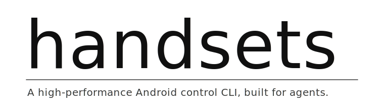

<p align="center">
  
</p>

<p align="center">
  <em>The device control plane you wished <code>adb</code> was.</em>
</p>

<p align="center">
  <a href="https://github.com/elliotgao2/handsets/releases/latest"></a>
  <a href="https://github.com/elliotgao2/handsets/actions/workflows/release.yml"></a>
  <a href="LICENSE"></a>
</p>

---

## Install

Requires `adb` on `$PATH`.

- macOS: `brew install android-platform-tools`
- Debian/Ubuntu: `sudo apt-get install -y android-tools-adb`
- Arch: `sudo pacman -S android-tools`

Then:

```bash
curl -fsSL https://raw.githubusercontent.com/elliotgao2/handsets/main/install.sh | bash
```

macOS and Linux. Pin a version with `HANDSETS_VERSION=v0.1.2 …`.

<details>
<summary>Build from source</summary>

```bash
git clone https://github.com/elliotgao2/handsets && cd handsets
./build.sh                                                          # daemon jar
cargo build --release --manifest-path handsets-cli/Cargo.toml       # `hs`
cargo build --release --manifest-path handsets-viewer/Cargo.toml    # `hs see` GUI (macOS)
ln -s "$PWD/handsets-cli/target/release/hs" /usr/local/bin/hs
```

</details>

## Quickstart

```bash
hs use                              # auto-detects device, starts the daemon
hs info                             # confirm — should print the device snapshot
hs ui -i                            # see what's on screen, in LLM-friendly form
hs tap "Continue"                   # text-lookup tap
hs drop                             # tear down the daemon when done
```

## How it works

The host CLI (`hs`) speaks a length-prefixed binary protocol over an
`adb forward`-ed TCP socket to a small JVM daemon running on the device
under `app_process` (shell UID, hidden-API restrictions lifted). The
daemon stays warm between commands, so there's no per-call cold start.
A host-side mirror subscribes to the daemon's `state_watch` stream and
atomically rewrites `~/.handsets/state-<port>.json` on every push, so
`hs info` / `hs show` are µs-level file reads. See
[Architecture](docs/architecture.md) for the binder/reflection details
and the sharp edges.

## At a glance

```bash
$ hs                                           # list devices
$ hs use                                       # connect, start daemon, mirror state
$ hs info                                      # neofetch-style snapshot (2 ms)
$ hs see x.jpg                                 # screenshot — 100× faster than adb
$ hs ui -i                                     # flat list of tappable nodes (LLM-friendly)
$ hs find 'TextView[text~=Login]'              # CSS-like selector over the live tree
$ hs open com.foo/.MainActivity && hs wait com.foo
$ hs type "EditText" "user@example.com"        # ACTION_SET_TEXT, no virtual keyboard
$ hs do <<'EOF'                                # persistent shell — many cmds, one socket
  tap_and_dump x=540 y=1500 idle_ms=200
EOF
```

## `hs ui -i` — the agent-friendly UI dump

`uiautomator2`'s `d.dump_hierarchy()` and Appium's `driver.page_source`
hand you the full XML — hundreds of KB per screen, mostly layout noise.
`hs ui -i` filters and flattens the same tree to only the nodes a human
or LLM can actually act on, usually **10–100× less text**:

```
@(54,160)    click             ImageButton                desc="Back"
@(540,360)                     TextView    #title         "Sign in to your account"
@(540,540)   click             EditText    #email         desc="Email"
@(540,640)   click,password    EditText    #password      desc="Password"
@(540,760)   check             CheckBox                   "Remember me"
@(540,860)   click             Button      #continue      "Continue"
@(540,960)   click             TextView                   "Forgot password?"
```

Four columns: **center coords / behaviour tags / class+id / text or desc**.
Drop into an LLM, get back coords, hand them to `hs tap X Y` — done.

## Verbs

### Devices

```
hs                                  list attached devices
hs use   [SERIAL]                   connect; auto-spawns the state mirror
hs drop  [SERIAL] [--keep-jar]      disconnect
```

### Inspect

```
hs info                             neofetch-style snapshot (2 ms, from local cache)
hs see                              live viewer (Metal + VideoToolbox H.264)
hs see   foo.{jpg,png,xml,json}     capture, format by extension
hs ui    [-i|--json|--xml] [--all]  UI tree dump — `-i` returns a flat,
                                      LLM-friendly table of tappable nodes
                                      (coords + tags + class + label)
hs find  SELECTOR                   CSS-like:  Tag[attr=val]:flag, comma = OR
hs show  [top | PKG]                device state | top activity | package info
hs apps  [--3rd]                    installed packages
```

Selector examples:

```bash
hs find 'Button[text="Sign in"]'                       # exact text match
hs find 'EditText[rid~=email]'                         # id contains "email"
hs find 'TextView[text~=Login]:clickable'              # flag filter
hs find 'Button[text="OK"], Button[text="Continue"]'   # comma = OR
```

### Activity

```
hs open      COMPONENT              start activity
hs close     PKG                    force-stop
hs install   APK [APK …]            streamed PackageInstaller, multi-APK
hs uninstall PKG
```

### Input

```
hs tap   "Login" | X Y              text-lookup or coords
hs type  TEXT                       KeyEvents to the focused field
hs type  SELECTOR TEXT              ACTION_SET_TEXT — atomic, bypasses the IME
hs go    back | home | recents | …  key events
hs swipe left|right|up|down [DUR_MS]    80% screen swipe (daemon picks coords)
hs swipe X1 Y1 X2 Y2 [DUR_MS]
```

### Sync

```
hs wait  idle [Nms] | TEXT | PKG | Nms      event-driven, no polling
hs cp    device:src dst | src device:dst    scp-style file transfer
```

### System

```
hs prop     [KEY [VAL]]             bare = list all; KEY = get; KEY VAL = set
hs settings [NS [KEY [VAL]]]        bare = list all 3; NS = list one;
                                      NS KEY = get; NS KEY VAL = set
```

### Diagnostics

```
hs logs   [--tail N | --follow]     logcat (default last 100)
hs events                           lifecycle stream (am monitor)
```

### Shell

```
hs shell                            interactive REPL (history, built-ins,
                                      unknown verbs fall through to /system/bin/sh)
hs do     [WIRE]                    same REPL, or one-shot raw wire
```

Raw wire reference: see [docs/wire.md](docs/wire.md).

## vs `uiautomator2`, Appium

Both wrap [UIAutomator](https://developer.android.com/training/testing/other-components/ui-automator)
and pay for the framework. Handsets runs a hand-rolled daemon directly
under `app_process` and talks to binders by reflection, so the wire is
tighter and the dump format is built for agents rather than reporters.

|  | **Handsets** | uiautomator2 | Appium |
|---|---|---|---|
| Wire | TCP long socket, length-prefixed binary | HTTP/JSON via `atx-agent` | WebDriver over HTTP |
| On-device install | push 1 jar (~few hundred KB) | 2 apks + `atx-agent` | driver apk + Node server |
| Daemon start | `< 200 ms` via `app_process`, no UIAutomator framework | UIAutomator instrumentation each session | UIAutomator + WebDriver bridge |
| State reads | µs from host-mirrored file (`hs info` / `hs show`) | ms per round-trip | ms+ per round-trip |
| UI dump for agents | `hs ui -i` flat, **~10× fewer tokens** | full XML | full XML |
| Selector | CSS-like `Tag[attr=val][attr~=sub]:flag` | `d(text=…, className=…)` chained | Selenium strategies |
| Bound to | any language via subprocess | Python only | multi-lang via WebDriver |
| Best at | LLM agents, ad-hoc scripts, high-freq small ops | Python device scraping | cross-platform CI suites |

Honest tradeoff: uiautomator2 and Appium ship with recorders, IDE
integrations, pytest runners, HTML reporting. Handsets is a lean CLI.
For pytest-style UI regression with reports they're still the smoother
path. Handsets is built for the case where you only care about
single-call latency and shell composition.

## Docs

- [Architecture](docs/architecture.md)
- [Benchmark](docs/benchmark.md)
- [Sharp edges](docs/sharp-edges.md)
- [Wire reference](docs/wire.md)

## License

MIT — see [LICENSE](LICENSE).
