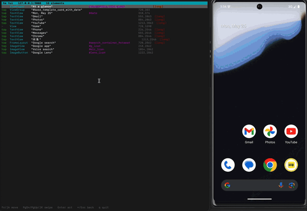

# A Terminal UI for Driving Android Apps

Most Android automation tools make you choose between two awkward modes.

You can write scripts, which are repeatable but slow to discover:

```bash
hs ui
hs tap "Continue"
hs fill "Email" "you@example.com"
```

Or you can use a visual tool, which is easier to explore but often separate from the thing you later automate.

`hs tui` is the missing middle: a terminal UI that lets you drive an Android app from the keyboard while showing the same action rows you would put in a script.

<p align="center">
  
</p>

It is not a remote desktop. It is not a recorder. It is a live, keyboard-driven inspector for Android's interactive UI.

<!-- more -->

## What it does

Run:

```bash
hs use
hs tui
```

The TUI opens in your terminal and shows the current interactive elements on the device:

```text
fill  EditText  "Email"     #email     540,540
fill  EditText  "Password"  #password  540,640  [password]
tap   Button    "Continue"  #continue  540,860
```

Move with the keyboard. Press Enter to act. If the selected row is a button, it taps. If it is an input field, it opens a small text modal and fills the field.

The useful part is that the TUI speaks the same vocabulary as the CLI:

- `tap Button "Continue" #continue`
- `fill EditText "Email" #email`
- `swipe up`
- `back`

Once the flow works by hand in `hs tui`, you already know what the script should look like.

## Why a terminal UI?

Android automation has a discovery problem.

When a script fails, you often ask:

- What does the device see right now?
- What text is actually exposed?
- Is this button clickable?
- Is there more than one matching "Continue"?
- Did the screen change after the tap?

The usual answer is to bounce between commands:

```bash
hs ui
hs tap "Continue"
hs ui
hs see screen.jpg
```

That works, but it has friction. You are copying labels out of one command and pasting them into another.

The terminal UI removes that loop. It keeps the UI list on screen and lets you act on the highlighted row.

## Keyboard model

The controls are intentionally boring:

| Key | Action |
| --- | --- |
| `↑` / `↓` or `j` / `k` | Move through interactive elements |
| `Enter` | Tap or fill the selected element |
| `PgDn` / `PgUp` | Swipe the device |
| `Shift+J` / `Shift+K` | Swipe faster |
| `←` / `Esc` | Android back |
| `q` | Quit |

That is enough for a surprising amount of app navigation.

The point is not to replace touch. The point is to make exploratory Android automation feel like using a terminal tool instead of a mouse, a screenshot viewer, and a pile of copy-paste.

## Live UI, not stale dumps

The TUI watches the device state in the background. It polls the accessibility tree and refreshes the list as the app changes.

That matters because Android screens are not static:

- Keyboards appear and disappear.
- Lists scroll.
- Buttons enable after validation.
- Loading states replace content.
- Animations keep the app from becoming "idle".

Traditional scripts often wait for idle, dump the tree, act, and repeat. That is safe, but it makes exploration feel choppy.

`hs tui` keeps the display live so you can tap, type, swipe, and watch the list update.

## The rows are the API

The TUI is built on the same compact UI model as `hs ui`.

Each row is an action-shaped description:

```text
tap   Button    "Continue"  #continue  540,860
fill  EditText  "Email"     #email     540,540
```

That format is doing two jobs:

1. It is readable enough for a human in a terminal.
2. It is structured enough to turn into automation.

This is the main design choice. The TUI does not show the full XML tree because that is not what you act on. It shows the controls you can use.

## Why this helps scripting

Many automation flows start with exploration:

1. Open the app.
2. Find the sign-in path.
3. Learn the labels.
4. Discover which waits are needed.
5. Turn that into a script.

Without a TUI, you do that with repeated dumps and screenshots.

With `hs tui`, you can walk the app once from the keyboard, then write the script using the labels you saw:

```bash
hs use
hs tap "Sign in"
hs fill "Email" "$APP_EMAIL"
hs fill "Password" "$APP_PASSWORD"
hs tap "Continue"
hs wait "Dashboard"
```

The manual path and the scripted path share the same model.

## Why this helps LLM agents

LLM agents need good observations and cheap actions.

A screenshot is useful, but it is heavy and often makes the model infer text visually. A full Android XML dump is faithful, but it can be thousands of tokens of layout noise.

The action table is smaller:

```text
fill  EditText  "Email"     #email     540,540
fill  EditText  "Password"  #password  540,640  [password]
tap   Button    "Continue"  #continue  540,860
```

The TUI uses the same representation humans and agents can both understand. That makes it a useful debugging surface for agent runs: if the model picked the wrong label, you can open the same screen and see what choices it had.

## Implementation notes

`hs tui` is a sibling binary to the core CLI.

The main `hs` binary stays small. When you run `hs tui`, it locates and launches `handsets-tui` with the current daemon host and port.

The TUI itself is built with:

- Rust
- `ratatui`
- `crossterm`
- the same length-prefixed Handsets wire protocol
- the same interactive-node filtering used by `hs ui`

The device side is still the normal Handsets daemon: one small jar running as the Android shell user through `adb`. No root required.

## What it is not

It is not meant to replace Appium, Espresso, or a full QA platform.

It is also not a pixel-perfect remote desktop. If you need a visual mirror, `hs see` can open the viewer or save screenshots.

`hs tui` is for the moment before and between scripts: when you want to drive the device quickly, learn the UI, and turn that knowledge into repeatable automation.

## Related guides

- [Fast Android UI Automation with ADB](2026-05-25-fast-android-ui-automation-with-adb.md)
- [How to Tap Android Buttons by Text from the Command Line](2026-05-25-tap-android-buttons-by-text-command-line.md)
- [Android Automation for LLM Agents](2026-05-25-android-automation-for-llm-agents.md)
